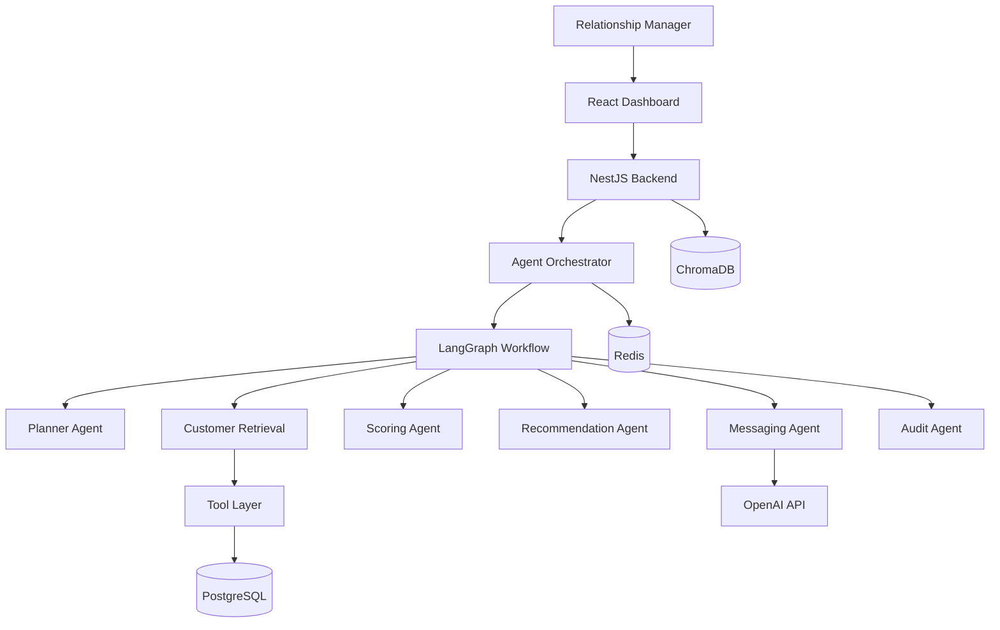

# Banking CRM Agentic AI

**Author:** Ayush Rawat  
**Version:** 1.0

An Agentic AI system that assists Relationship Managers (RMs) in identifying high-value customers, estimating conversion likelihood, recommending banking products, and generating personalized WhatsApp outreach — with full explainability and human-in-the-loop approval.

---

## Architecture



## Execution Flow

1. **RM submits natural language query** via React dashboard
2. **Planner Agent** parses intent and product type (personal loan, credit card, etc.)
3. **Customer Retrieval Agent** calls tools to fetch customers, transactions, CRM notes, loans, campaigns
4. **Scoring Agent** applies deterministic business rules (0–100 conversion score)
5. **Recommendation Agent** checks product eligibility and ranks customers
6. **Messaging Agent** generates personalized WhatsApp messages via OpenAI
7. **Audit Agent** logs steps, prompt versions, and timing
8. **RM reviews and approves** messages before any outreach

## Project Structure

```
banking-crm/
├── apps/
│   ├── backend/                 # NestJS REST API + tools + orchestrator
│   └── frontend/                # React + Vite RM dashboard
├── packages/
│   ├── agent-core/              # LangGraph workflow & agents
│   ├── scoring-engine/          # Deterministic conversion scoring
│   ├── recommendation-engine/   # Product eligibility & ranking
│   ├── prompts/                 # Versioned LLM prompts
│   ├── evaluation-engine/       # Workflow evaluation / benchmarks
│   ├── shared-types/            # Shared TypeScript types
│   ├── tools/                   # Shared tool contracts
│   └── config/                  # Environment config & feature flags
├── prisma/                      # Schema, migrations, seed data
├── docs/                        # Design docs + demo script PDF
├── docker/
└── docker-compose.yml
```

## Tool Design

| Tool | Purpose | Data Source |
|------|---------|-------------|
| `CustomerTool` | Retrieve high-value candidates | PostgreSQL |
| `TransactionTool` | Fetch recent transactions | PostgreSQL |
| `CrmTool` | Retrieve CRM notes | PostgreSQL |
| `LoanTool` | Fetch loan history | PostgreSQL |
| `CampaignTool` | Prior campaign engagement | PostgreSQL |
| `ProductTool` | Product eligibility rules | PostgreSQL |
| `ScoringTool` | Deterministic conversion scoring | Business rules |
| `RecommendationTool` | Product matching & ranking | Rules engine |
| Message generation | Personalized WhatsApp drafts | OpenAI (+ fallback) |

## Key Design Decisions

| Decision | Rationale |
|----------|-----------|
| LangGraph for orchestration | Shared state, conditional flows, extensibility |
| Deterministic scoring | Explainable, testable, no LLM hallucination on numbers |
| LLM for planning & messaging | Separation of reasoning vs. business logic |
| Monorepo with shared packages | Type safety across backend, agents, frontend |
| Human approval workflow | Prevents accidental customer outreach |
| NestJS DI throughout | Enterprise patterns, testability |

## Trade-offs & Limitations

- **ChromaDB** is in the compose stack for future semantic search; session memory currently uses PostgreSQL
- **SSE streaming** is implemented on the API; the main UI path uses synchronous `POST /agent/query`
- **Scoring rules** are heuristic-based, not trained ML models
- **No live WhatsApp sending** — messages are generated as drafts for RM approval only
- **Seed data** includes 1,000 customers (plus related transactions, notes, loans, campaigns) for local demos

---

## Prerequisites

- Node.js 22+
- Docker & Docker Compose
- OpenAI API key (optional — fallback messages work without it)

## Quick Start

### 1. Clone and configure

```bash
cp .env.example .env
# Edit .env and set OPENAI_API_KEY (optional)
```

### 2. Start infrastructure

```bash
docker compose up postgres redis chroma -d
```

### 3. Install dependencies

```bash
npm install
```

### 4. Setup database

```bash
npm run db:generate
npm run db:push
npm run db:seed
```

### 5. Run development servers

```bash
npm run dev
```

- **Frontend:** http://localhost:5173
- **Backend API:** http://localhost:3000/api/v1
- **Swagger Docs:** http://localhost:3000/api/docs

### 6. Login

```
Email: rm@bank.com
Password: password123
```

## Docker (Full Stack)

```bash
docker compose up --build
```

## API Endpoints

| Method | Endpoint | Description |
|--------|----------|-------------|
| POST | `/api/v1/auth/login` | JWT authentication |
| POST | `/api/v1/agent/query` | Run agent workflow |
| GET | `/api/v1/conversations/sessions` | List agent sessions |
| GET | `/api/v1/messaging/pending` | Messages awaiting approval |
| PATCH | `/api/v1/messaging/:id` | Approve / reject / edit message |
| GET | `/api/v1/analytics/summary` | Dashboard analytics |
| GET | `/api/v1/customers` | List customers |
| GET | `/api/v1/recommendations` | Recommendation history |
| GET | `/api/v1/evaluation/benchmarks` | Evaluation benchmarks |
| GET | `/api/v1/health` | Health check |

## Database Schema

The database follows the design in `docs/database-design.md` with core banking and AI tables:

| Category | Tables |
|----------|--------|
| Core Banking | `roles`, `users`, `customers`, `customer_products`, `products`, `transactions`, `loans`, `crm_notes`, `campaigns` |
| AI & Recommendations | `product_recommendations`, `generated_messages`, `conversations`, `conversation_messages`, `prompt_versions`, `audit_logs`, `feature_flags` |

### Seed Data Volumes

| Entity | Count |
|--------|-------|
| Customers | 1,000 |
| Transactions | ~100,000 |
| CRM Notes | 5,000 |
| Loans | 1,500 |
| Campaigns | 4,000 |
| Recommendations | 1,000 |
| Generated Messages | 1,000 |
| Audit Logs | 10,000 |

---

## Demo Use Cases

1. **Personal Loan Discovery** — "Find high-value customers likely to convert for a personal loan and generate WhatsApp messages"
2. **Credit Card Upsell** — "Identify customers eligible for premium credit cards with strong transaction history"
3. **Fixed Deposit Campaign** — "Find customers suitable for fixed deposits with high average balance"

See `docs/Demo-Video-Script-Banking-CRM.pdf` for the full demo video script and talking points.

## Environment Variables

See `.env.example` for configuration options including feature flags:

- `ENABLE_MEMORY` — Session conversation memory
- `ENABLE_STREAMING` — SSE progress updates
- `ENABLE_AUDIT` — Audit trail logging
- `ENABLE_CACHE` — Redis caching

## Testing

```bash
npm run test -w @banking-crm/backend
npm run test -w @banking-crm/agent-core
```

## License

MIT
